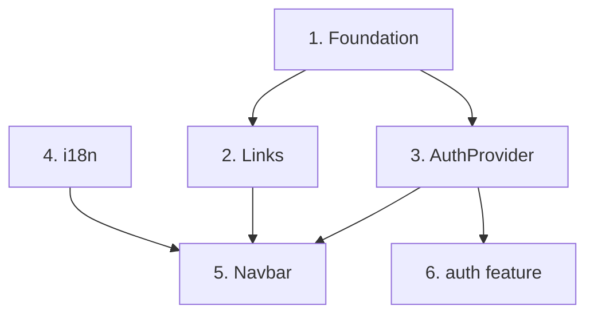

# Plan Implementation

Bridge between design artifacts and code scaffolding. Reads PRD, UX spec, and build-order prompts, then produces a structured implementation plan. Each deliverable maps to one of two downstream skills:

- **create-feature** — domain features with entities, API endpoints, CRUD (lives in `features/`)
- **create-infrastructure** — shared infrastructure: providers, hooks, layouts, i18n, config (lives in `shared/`)

## When to Use

- After `ux-to-prompt` generates build-order prompts
- When you have a PRD and want to plan which features to scaffold
- When starting implementation of a multi-feature project
- When you need to map UX components to the `features/` or `shared/` directory structure
- When building shared infrastructure (layouts, providers, i18n) before domain features

## Required Inputs

Locate these documents (ask the user if paths are unclear):

1. **PRD** — the original product requirements document
2. **Clarified PRD** — if `prd-clarifier` was used (optional)
3. **UX Specification** — the output from `prd-to-ux` (optional but recommended)
4. **Build-Order Prompts** — the output from `ux-to-prompt` (optional but recommended)

At minimum you need the PRD. The more artifacts available, the more precise the extraction.

## Process

### Step 1: Identify and Classify Candidates

Scan the design artifacts and extract every distinct deliverable. **Classify each** as either a domain feature or an infrastructure deliverable.

**Classification criteria:**

| Signal | Domain Feature | Infrastructure Deliverable |
|--------|---------------|---------------------------|
| Has a primary entity with fields | Yes | No |
| Consumes external API endpoints | Yes | Rarely |
| Has CRUD operations | Yes | No |
| Lives in | `features/{name}/` | `shared/`, `public/`, project root |
| Examples | `payment`, `reservation` | `auth-provider`, `app-layout`, `i18n-setup` |

**From the PRD:**
- Section 4 "Core Use Case" — each major step often maps to a feature
- Section 5 "Functional Decisions" — capabilities group into features OR infrastructure
- Section 7 "Data & Logic" — data sources reveal entities (domain) vs config (infra)

**From the UX Spec (if available):**
- Pass 2 "Information Architecture" — concept groups map to features
- Pass 3/7 "Layout & Sizing" — layout components are infrastructure
- Pass 5 "State Design" — each element with its own state table is likely a feature

**From Build-Order Prompts (if available):**
- Core Components phase — layout components are infrastructure, data-driven components are features
- Forms — each form is part of a domain feature

**Output a candidate list with classification:**

```markdown
## Candidate Features

| # | Name | Source | Type | Primary Concept |
|---|------|--------|------|-----------------|
| 1 | auth | PRD §4 step 1, UX Pass 5 | Domain Feature | AuthSession entity |
| 2 | app-layout | PRD §5 F6, Build Prompt #8 | Infrastructure | Layout shell |
| 3 | auth-provider | PRD §5 F8, Clarification Q3 | Infrastructure | Auth context |
| 4 | reservation | PRD §5 F-03, Build Prompt #4 | Domain Feature | Reservation entity |
```

**If ALL candidates are infrastructure** (no domain entities, no API CRUD), state this explicitly:

```markdown
## Feature Summary

This project is **shared infrastructure**, not domain features with CRUD operations.
The `create-feature` skill does NOT apply. Use the `create-infrastructure` skill
to scaffold each deliverable following the `new-app/shared/` conventions.
```

### Step 2: Extract Specs

Produce a spec block for each candidate. The format depends on the classification.

#### 2A: Domain Feature Spec

For candidates classified as **Domain Feature**, produce a block matching `create-feature` skill inputs:

```markdown
### Feature: {name}

**Feature name:** {singular, lowercase}

**Main entity fields:**
- id: number
- name: string
- status: 'active' | 'inactive'
- createdAt: string (ISO date)
- ...

**API endpoints:**
- `GET /api/{feature}s` — list (paginated)
- `GET /api/{feature}s/:id` — detail
- `POST /api/{feature}s` — create
- `PATCH /api/{feature}s/:id` — update
- `DELETE /api/{feature}s/:id` — delete

**Operations needed:**
- [x] List (paginated)
- [x] Detail
- [x] Create
- [x] Update
- [ ] Delete

**UX components mapped:**
- {feature}-list.tsx — from Build Prompt #3
- {feature}-form.tsx — from Build Prompt #5
- {feature}-card.tsx — from Build Prompt #3

**Needs Zustand store:** Yes/No
- Reason: [e.g., "filters, search state, selected items"]

**Domain errors (if any):**
- {Feature}NotFoundError (404)
- {Feature}ValidationError (422)
```

#### 2B: Infrastructure Deliverable Spec

For candidates classified as **Infrastructure Deliverable**, produce a block matching `create-infrastructure` skill inputs:

```markdown
### Deliverable N: {Name}

**Type:** {Provider | Hook | Layout component | Layout shell | i18n namespace | Shared utility | Config/Foundation | Test page}
**File:** `{target path relative to src/new-app/ or project root}`
**Depends on:** {list of other deliverables or "Nothing"}
**Acceptance:** {how to verify it works}

**Props / API surface:**
- propName: type — description
- optionalProp?: type — description

**Exports:**
- `{ExportedName}` — component/hook/type
```

**Infrastructure type reference** (see `create-infrastructure` skill for full catalog):

| Type | Location | Example |
|------|----------|---------|
| Provider | `shared/providers/{name}.tsx` | `auth-provider.tsx` |
| Hook | `shared/hooks/{name}.ts` | `use-navbar-items.ts` |
| Layout component | `shared/layouts/components/{name}.tsx` | `navbar.tsx` |
| Layout shell | `shared/layouts/{name}.tsx` | `app-layout.tsx` |
| i18n namespace | `public/locales/{locale}/{namespace}.json` | `app-layout.json` |
| Shared utility | `shared/{module}/index.ts` | `shared/links/index.ts` |
| Config/Foundation | project root or `src/styles/` | `globals.css`, `components.json` |
| Test page | `pages/{page-name}.tsx` | `reservation-details-v2/[id].tsx` |

### Step 3: Identify Shared Infrastructure

List everything that spans multiple features or must exist before scaffolding begins. This section is always present, but its scope varies:

- **For domain-feature projects:** shared infrastructure is supporting plumbing (routes, interceptors, shared components).
- **For infrastructure-only projects:** this section IS the main content. Expand it with the full deliverable table.

```markdown
## Shared Infrastructure (do first)

| # | Deliverable | Type | Location | Complexity |
|---|------------|------|----------|------------|
| 1 | Foundation | Config/Foundation | `globals.css`, `components.json` | Low |
| 2 | Centralized links | Shared utility | `shared/links/index.ts` | Low |
| 3 | AuthProvider | Provider | `shared/providers/auth-provider.tsx` | Low |
| 4 | i18n translations | i18n namespace | `public/locales/{en,es}/app-layout.json` | Low |
| 5 | Navbar + Sheet | Layout component | `shared/layouts/components/navbar.tsx` | Medium |

### Routes to add (`shared/links/index.ts`)
- `links.public.signIn: '/login'`
- `links.private.dashboard: '/dashboard'`

### shadcn components to install
- `pnpm dlx shadcn@latest add sheet button separator`

### Dependencies to install
- `pnpm add tw-animate-css` (if not present)

### API client changes
- None / [e.g., "add auth header interceptor"]
```

### Step 4: Determine Implementation Order

Order all deliverables (both domain features and infrastructure) by dependencies.

**Infrastructure-first rule:** shared infrastructure always comes before domain features that depend on it.

```markdown
## Implementation Order

| Order | Deliverable | Type | Depends On | Complexity | Parallelizable With |
|-------|------------|------|-----------|------------|---------------------|
| 1 | Foundation | Infra | — | Low | i18n (#4) |
| 2 | Centralized links | Infra | Foundation | Low | — |
| 3 | AuthProvider | Infra | Foundation | Low | i18n (#4) |
| 4 | i18n translations | Infra | — | Low | Foundation (#1) |
| 5 | Navbar + Sheet | Infra | useNavbarItems, shadcn | Medium | BackHeader (#7) |
| 6 | auth | Feature | AuthProvider | Medium | — |
| 7 | reservation | Feature | auth, location | High | — |

**Rationale:** Foundation must come first. i18n can be created in parallel (just JSON files). Infrastructure deliverables that depend only on Foundation can be parallelized. Domain features come after the shared infrastructure they depend on.
```

Include a **dependency graph** when there are 5+ deliverables:

````markdown

````

### Step 5: Write the Plan Document

Combine all sections into a single markdown file:

```
{prd-basename}-implementation-plan.md
```

Save it in the **same directory** as the source PRD.

**Document structure:**

```markdown
# Implementation Plan: {Project Name}

## Source Documents
- **PRD**: [path]
- **Clarified PRD**: [path or "N/A"]
- **UX Specification**: [path or "N/A"]
- **Build-Order Prompts**: [path or "N/A"]

---

## Feature Summary

[One of two formats:]

### Format A: Mixed (domain features + infrastructure)

| # | Name | Type | Entity/Concept | Operations/Purpose | Complexity |
|---|------|------|---------------|-------------------|------------|
| 1 | auth-provider | Infra | Auth context | Provider + useAuth hook | Low |
| 2 | auth | Feature | AuthSession | signIn, refresh | Medium |
| 3 | reservation | Feature | Reservation | list, detail, create, update | High |

### Format B: Infrastructure-only

This project is **shared infrastructure**, not domain features with CRUD operations.
The deliverables are reusable layout components, providers, hooks, and config.
None of these map to the `create-feature` skill. Use `create-infrastructure` instead.

| # | Deliverable | Type | Location | Complexity |
|---|------------|------|----------|------------|
| 1 | Foundation | Config/Foundation | `globals.css`, `components.json` | Low |
| 2 | AuthProvider | Provider | `shared/providers/auth-provider.tsx` | Low |

---

## Candidate Features
[from Step 1 — classification table]

## Shared Infrastructure
[from Step 3 — deliverable table, routes, dependencies]

## Implementation Order
[from Step 4 — ordered table with dependency graph]

## Feature Specifications
[from Step 2A — one block per domain feature, if any]

## Deliverable Specifications
[from Step 2B — one block per infrastructure deliverable, if any]

---

## Validation Checklist
[filled-in checklist]
```

## Validation Checklist

Before finalizing the plan:

- [ ] Every PRD functional requirement maps to at least one candidate (feature or deliverable)
- [ ] Every candidate is classified as "Domain Feature" or "Infrastructure Deliverable"
- [ ] Every domain feature has: name, entity fields, endpoints, operations
- [ ] Every infrastructure deliverable has: name, type, location, dependencies, acceptance criteria
- [ ] API endpoints use the project's endpoint naming conventions
- [ ] Entity fields include types (not just names)
- [ ] Implementation order respects dependencies
- [ ] Shared infrastructure is identified and listed first
- [ ] UX components are mapped to deliverables (if build-order prompts exist)
- [ ] No candidate is missing from the list
- [ ] If project is infrastructure-only, plan explicitly states `create-feature` does not apply and `create-infrastructure` is used
- [ ] Routes use centralized links (not hardcoded)

## Resume After Context Cleanup

If context was cleaned mid-pipeline, restore state before proceeding:

1. **Check for in-progress pipeline:** Look for `.claude/pipeline/*/OBSERVATION-LOG.md` with `Status: In Progress`
2. **Read DECISIONS.md** in the feature folder for accumulated context
3. **Read the relevant artifact** for this skill's input:
   - The PRD, UX spec, and build-order prompts files
4. **Resume the observer** if an OBSERVATION-LOG.md exists and is in progress
5. **Continue from where you left off** — don't restart the skill from scratch

## Next Step

After completing this skill, use the `AskUserQuestion` tool to present the next step options. Include a summary of what was completed in the question text. The options depend on the plan content:

**If the plan is infrastructure-only:**

Options to present:

- **create-infrastructure** — scaffold {first deliverable}
- **Something else** — do something different

**If the plan has both domain features and infrastructure:**

Options to present:

- **create-infrastructure** — scaffold infrastructure first
- **create-feature** — scaffold {first feature}
- **Something else** — do something different

**Skill routing:**

- For domain features: invoke `create-feature` (`.cursor/skills/create-feature/SKILL.md`) with the feature spec
- For infrastructure deliverables: invoke `create-infrastructure` (`.cursor/skills/create-infrastructure/SKILL.md`) with the deliverable spec

Do NOT present numbered text options and ask the user to "type a number." Always use the `AskUserQuestion` tool for skill transitions.

## Context Management

After completing this skill's work, report the **context usage percentage** so the user can decide whether to clean context:

> "{Skill output summary}. Context usage: **{X}%**"

Do NOT recommend cleaning context — just show the percentage. The user will decide.

## Related Skills

| Skill | Relationship |
|-------|-------------|
| **ux-to-prompt** | Upstream — produces build-order prompts consumed here |
| **create-feature** | Downstream — scaffolds domain features (entity + API + CRUD) |
| **create-infrastructure** | Downstream — scaffolds shared infrastructure (providers, hooks, layouts, i18n) |
| **react-clean-architecture** | Reference — informs layer decisions during extraction |
| **error-handling** | Reference — informs domain error identification |
