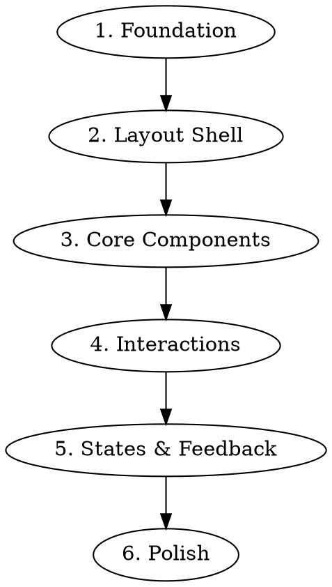

# UX Spec to Build-Order Prompts

## Overview

Transform detailed UX specifications into a sequence of self-contained prompts optimized for UI generation tools. Each prompt builds one discrete feature/view with full context included.

## When to Use

- User has a UX spec, PRD, or detailed feature documentation
- Output needs to feed into UI generation tools (v0, Bolt, Claude, etc.)
- User wants build-order sequencing (foundations → features → polish)
- Large specs that would overwhelm a single prompt

**Not for:** Quick component requests, already-atomic features, specs that fit in one prompt.

## Related Skills

Reference these skills when generating prompts:

- **shadcn-ui** (`.cursor/skills/shadcn-ui/SKILL.md`): Component patterns, form validation (React Hook Form + Zod), accessibility. Include component-specific details in prompts.
- **tailwindcss-fundamentals-v4** (`.cursor/skills/tailwindcss-fundamentals-v4/SKILL.md`): OKLCH colors, fluid typography, @theme configuration, custom utilities. Include styling specifications in prompts.
- **react-clean-architecture** (`.cursor/skills/react-clean-architecture/SKILL.md`): Layer separation, component responsibilities, when to extract hooks. Reference for architectural decisions in prompts.
- **create-feature** (`.cursor/skills/create-feature/SKILL.md`): Feature scaffolding structure. Use after prompts are generated for implementation.

## Core Pattern

```
UX Spec → Extract Atomic Units → Sequence by Dependencies → Generate Self-Contained Prompts
```

## Build Order Strategy

Generate prompts in this order:



| Phase | What to Include | shadcn/ui & Tailwind Focus |
|-------|-----------------|---------------------------|
| **Foundation** | Design tokens, typography setup, extended color palette, shared types, base styles | @theme config, CSS variables, cn() utility, next/font setup, design language tokens |
| **Layout Shell** | Page structure, navigation, panels | Sheet, NavigationMenu, Sidebar patterns |
| **Core Components** | Primary UI elements (nodes, cards, inputs) | Card, Form, Input, Select, Button |
| **Interactions** | Drag-drop, connections, pickers | Dialog, Popover, DropdownMenu, Command |
| **States & Feedback** | Empty, loading, error, success states | Skeleton, Alert, Toast (sonner), Progress |
| **Polish** | Animations, responsive, edge cases | Motion (motion.dev), tw-animate-css, motion-reduce, responsive breakpoints |

## Prompt Structure Template

Each generated prompt follows this structure:

```markdown
## [Feature Name]

### Context
[What this feature is and where it fits in the app]

### Requirements
- [Specific behavior/appearance requirement]
- [Another requirement]
- [Include relevant specs: dimensions, colors, states]

### shadcn/ui Components
- [Primary component]: [e.g., Card, Dialog, Form]
- [Supporting components]: [e.g., Button, Input, Select]
- [Feedback components]: [e.g., Toast, Alert, Skeleton]

### Tailwind Styling
- [Layout]: [e.g., flex, grid patterns]
- [Spacing]: [e.g., gap-4, p-6]
- [Colors]: [e.g., bg-primary, text-muted-foreground]
- [Responsive]: [e.g., md:grid-cols-2, lg:px-8]

### Design Language
- [Typography]: [Inter weight/size/tracking if this component diverges from base hierarchy]
- [Color accent]: [Accent colors from the design language pass applied here]
- [Motion]: [Animations for this component — easing, duration, trigger]
- [Signature detail]: [Any distinctive visual element from Pass 8 applied here]

### States
- Default: [description]
- Loading: [Skeleton pattern from shadcn/ui]
- Empty: [EmptyState pattern]
- Error: [Alert destructive variant]
- Success: [Toast notification]
- [Other states from spec]

### Interactions
- [How user interacts]
- [Keyboard support if applicable]
- [Form validation rules if applicable]

### Constraints
- [Technical or design constraints]
- [What NOT to include]
```

## Extraction Process

### Step 1: Identify Atomic Units

Read through the spec and list discrete buildable features:
- Each screen/view
- Each reusable component
- Each interaction pattern
- Each state variation

### Step 2: Map Dependencies

For each unit, note what it requires:
- "Node card requires design tokens"
- "Connection lines require nodes to exist"
- "Lens picker requires prompt field"

### Step 3: Sequence by Dependency Graph

Order units so dependencies come first. Group related items into single prompts when they're tightly coupled.

### Step 4: Write Self-Contained Prompts

For each prompt:
1. **Re-state relevant context** - Don't assume reader saw previous prompts
2. **Include specific measurements** - Extract from spec (dimensions, spacing)
3. **Include all states** - Pull from state design section
4. **Include interaction details** - Pull from affordances section
5. **Set boundaries** - What this prompt does NOT include

## Self-Containment Rules

Each prompt MUST include:
- Enough context to understand the feature in isolation
- All visual specs (colors, spacing, dimensions) relevant to that feature
- All states that feature can be in
- All interactions for that feature

Each prompt MUST NOT:
- Reference "see previous prompt" or "as described earlier"
- Assume knowledge from other prompts
- Leave specs vague ("appropriate styling")

## Example Transformation

See [references/example-prompt.md](references/example-prompt.md) for a full before/after example showing how a UX spec node card transforms into a self-contained build prompt.

## Output Format

Generate a markdown document with:

```markdown
# Build-Order Prompts: [Project Name]

## Source Documents
- **PRD**: [path to original PRD]
- **Clarified PRD**: [path to clarified PRD, if exists]
- **UX Specification**: [path to UX spec]

## Tech Stack Reference
- **Components**: shadcn/ui (see `.cursor/skills/shadcn-ui/SKILL.md`)
- **Styling**: Tailwind CSS v4 (see `.cursor/skills/tailwindcss-fundamentals-v4/SKILL.md`)
- **Architecture**: Clean Architecture principles (see `.cursor/skills/react-clean-architecture/SKILL.md`)
- **Forms**: React Hook Form + Zod
- **State**: TanStack Query (server) + Zustand (UI state, if feature needs it)

## Overview
[1-2 sentence summary of what's being built]

## Build Sequence
1. [Prompt name] - [brief description] - [shadcn components used]
2. [Prompt name] - [brief description] - [shadcn components used]
...

---

## Prompt 1: [Feature Name]
[Full self-contained prompt with shadcn/ui and Tailwind specifics]

---

## Prompt 2: [Feature Name]
[Full self-contained prompt with shadcn/ui and Tailwind specifics]

...
```

## Quality Checklist

Before finalizing prompts:

- [ ] Every measurement from spec is captured in a prompt
- [ ] Every state from spec is captured in a prompt
- [ ] Every interaction from spec is captured in a prompt
- [ ] No prompt references another prompt
- [ ] Build order respects dependencies
- [ ] Each prompt could be given to someone with no context
- [ ] shadcn/ui components are specified for each UI element
- [ ] Tailwind classes are included for styling (colors, spacing, layout)
- [ ] Form prompts include React Hook Form + Zod validation patterns
- [ ] State feedback uses correct shadcn/ui components (Skeleton, Toast, Alert)
- [ ] Accessibility considerations are included (focus states, ARIA, keyboard nav)
- [ ] Design language decisions from Pass 8 are reflected (typography, color, motion)
- [ ] Foundation prompt includes font loading setup (`next/font`) and any new CSS tokens
- [ ] Typographic hierarchy is defined — Inter weights, sizes, and tracking are deliberate choices
- [ ] At least one component has a signature visual detail or spatial personality
- [ ] Motion is specified for high-impact moments (page load, key transitions)

## Common Mistakes

| Mistake | Fix |
|---------|-----|
| Prompts too large (whole spec in one) | Break into atomic features |
| Prompts reference each other | Re-state needed context inline |
| Missing states | Cross-reference spec's state design section |
| Vague measurements ("good spacing") | Use exact values from spec |
| Wrong build order | Check dependency graph |
| Duplicated component definitions | Each component defined once, in first prompt that needs it |

---

## Resume After Context Cleanup

If context was cleaned mid-pipeline, restore state before proceeding:

1. **Check for in-progress pipeline:** Look for `.claude/pipeline/*/OBSERVATION-LOG.md` with `Status: In Progress`
2. **Read DECISIONS.md** in the feature folder for accumulated context
3. **Read the relevant artifact** for this skill's input:
   - The UX spec file and any existing build-order prompts draft
4. **Resume the observer** if an OBSERVATION-LOG.md exists and is in progress
5. **Continue from where you left off** — don't restart the skill from scratch

## Next Step

After completing this skill, use the `AskUserQuestion` tool to present the next step options. Include a summary of what was completed in the question text.

Options to present:

- **plan-implementation** — create implementation plan from design artifacts
- **Something else** — do something different

Do NOT present numbered text options and ask the user to "type a number." Always use the `AskUserQuestion` tool for skill transitions.

## Context Management

After completing this skill's work, report the **context usage percentage** so the user can decide whether to clean context:

> "{Skill output summary}. Context usage: **{X}%**"

Do NOT recommend cleaning context — just show the percentage. The user will decide.
